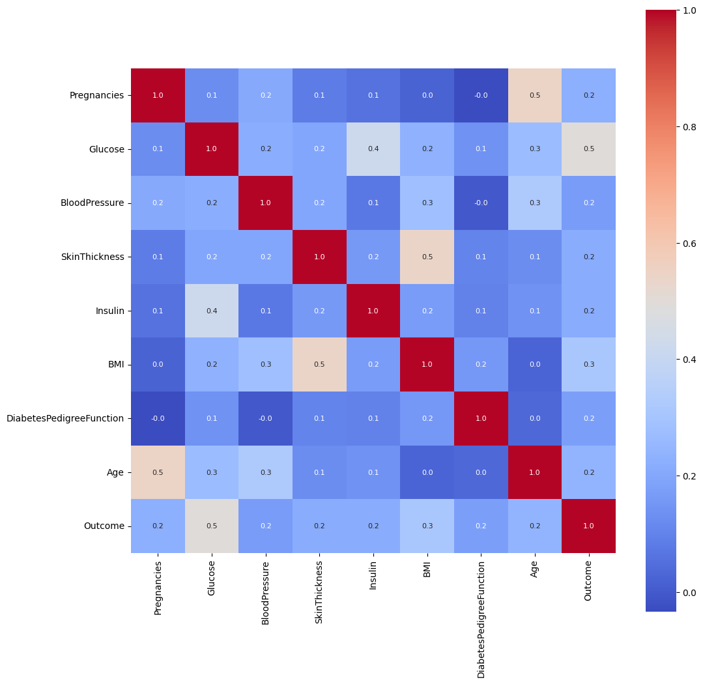

# **Laporan Proyek Machine Learning - Shefiyyah Aurellia Wahyudi** 

## Domain Proyek
Meningkatnya kesulitan dalam mengekstraksi informasi yang berguna untuk mendukung keputusan dari sistem informasi medis yang besar dan kompleks di rumah sakit dan institusi medis modern. Analisis data manual tradisional menjadi tidak efisien, dan ada kebutuhan akan metode analisis berbasis komputer yang efisien untuk mengatasi tantangan ini. Pengenalan pembelajaran mesin ke dalam analisis medis telah terbukti meningkatkan akurasi diagnostik, mengurangi biaya, dan meminimalkan kebutuhan sumber daya manusia. Urgensi untuk mengatasi masalah ini terletak pada kebutuhan akan alat diagnostik yang akurat dan efisien untuk mengidentifikasi dan mengelola diabetes secara tepat waktu. Kompleksitas dan volume data medis dalam sistem perawatan kesehatan modern membuat analisis manual tradisional menjadi tidak efisien, sehingga memerlukan penggunaan metode analisis berbasis komputer yang canggih[1]. 

Untuk memberikan wawasan tentang fitur-fitur penting untuk metode klasifikasi KNN dalam memprediksi diabetes berdasarkan PIMA Indian Database. Dengan mengatasi kesenjangan ini, bertujuan untuk berkontribusi pada pemahaman tentang fitur-fitur penting untuk prediksi diabetes yang akurat[2] 

## Business Understanding
1. Dalam diagnosis medis, seperti diagnosis diabetes Pima Indian, terletak pada kebutuhan akan alat diagnostik yang akurat dan efisien untuk mengidentifikasi dan mengelola diabetes secara tepat waktu. 
2. Ketika sistem informasi medis di rumah sakit modern dan institusi medis menjadi semakin besar, hal ini menyebabkan kesulitan besar dalam mengekstraksi informasi yang berguna untuk mendukung keputusan. Analisis data manual tradisional menjadi tidak efisien dan metode untuk analisis berbasis komputer yang efisien menjadi sangat penting. Telah terbukti bahwa manfaat memperkenalkan pembelajaran mesin ke dalam analisis medis adalah untuk meningkatkan akurasi diagnostik, mengurangi biaya, dan mengurangi sumber daya manusia. 

Bagian laporan ini mencakup:

### Problem Statements
1. Bagaimana penggunaan metode KNN dalam menganalisis fitur-fitur penting dalam database PIMA Indian untuk memprediksi diabetes?
2. Apa saja fitur-fitur penting yang diperlukan oleh metode KNN untuk mencapai akurasi tinggi dari database PIMA Indian?
3. Apakah fitur diabetes pedigree function diperlukan atau relevan dalam metode klasifikasi KNN untuk memprediksi diabetes?

### **Goals** 
1. Menganalisis fitur-fitur penting dalam database PIMA Indian menggunakan metode KNN untuk klasifikasi diabetes.
2. Menemukan fitur-fitur penting yang diperlukan oleh metode KNN untuk mencapai akurasi tinggi dari database PIMA Indian.
3. Menentukan apakah fitur diabetes pedigree function diperlukan, relevan, atau dapat dihilangkan dalam metode klasifikasi KNN untuk memprediksi diabetes.

##### **Solution statements** 
Dengan membuat model machine learning dengan Model Development dari K-Nearest Neighbor dapat mengetahui yang mana saja pasien yang terkena penyakit diabetes 

## Data Understanding
Berikut link Diabetes dataset dari kaggle https://www.kaggle.com/datasets/uciml/pima-indians-diabetes-database 
- Terdapat 768 baris (records atau jumlah pengamatan) dalam dataset.
- Terdapat 9 kolom yaitu: Pregnancies, Glucose, BloodPressure, SkinThickness, Insulin, BMI, DiabetesPedigreeFunction, Age, Outcome. 

### Variabel-variabel pada dataset adalah sebagai berikut:
- Pregnancies: Berapa kali hamil
- Glucose: Konsentrasi glukosa plasma 2 jam dalam tes toleransi glukosa oral
- BloodPressure: Tekanan darah diastolik (mm Hg)
- SkinThickness: Ketebalan lipatan kulit trisep (mm)
- Insulin: Insulin serum 2 jam (mm U/ml)
- BMI: Indeks massa tubuh (berat badan dalam kg/(tinggi badan dalam m)^2)
- DiabetesPedigreeFunction: Fungsi silsilah Diabetes
- Age: umur(tahun)
- Outcome: Variabel kelas (0 atau 1) 268 dari 768 adalah 1, yang lainnya adalah 0

**Rubrik/Kriteria Tambahan**:
 
Pada multivariate analysis ditemukan bahwa Pada baris paling bawah (nilai korelasi terhadap kolom Outcome), terlihat hampir semua kotak cenderung berwarna biru, yang berarti nilainya mendekati 0. Ini menandakan bahwa hampir semua fitur tidak memiliki hubungan signifikan dengan dengan kolom Outcome.

## Data Preparation
Pada bagian ini akan melakukan 2 tahap persiapan data, yaitu: 

- Pembagian dataset dengan fungsi train_test_split dari library sklearn. 
Pada tahap ini menggunakan beberapa variabel dan parameter diantaranya:
  - Variabel X menyimpan fitur-fitur dari dataset kecuali kolom "Outcome".
  - Variabel y menyimpan kolom "Outcome", yang berisi label apakah pasien memiliki diabetes atau tidak.
  - Fungsi train_test_split digunakan untuk membagi dataset menjadi data pelatihan dan data uji. Data uji sebesar 10% dari keseluruhan dataset (ditentukan oleh parameter test_size=0.1).
  - Parameter random_state=123 digunakan untuk menetapkan seed agar hasil pemisahan dapat direproduksi dengan cara yang sama setiap kali kode dijalankan.
  
- Standarisasi
Algoritma machine learning memiliki performa lebih baik dan konvergen lebih cepat ketika dimodelkan pada data dengan skala relatif sama atau mendekati distribusi normal. Proses scaling dan standarisasi membantu untuk membuat fitur data menjadi bentuk yang lebih mudah diolah oleh algoritma.  
Standardisasi adalah teknik transformasi yang paling umum digunakan dalam tahap persiapan pemodelan. Untuk fitur numerik, kita tidak akan melakukan transformasi dengan one-hot-encoding seperti pada fitur kategori. Kita akan menggunakan teknik StandarScaler dari library Scikitlearn,  
StandardScaler melakukan proses standarisasi fitur dengan mengurangkan mean (nilai rata-rata) kemudian membaginya dengan standar deviasi untuk menggeser distribusi.  StandardScaler menghasilkan distribusi dengan standar deviasi sama dengan 1 dan mean sama dengan 0. Sekitar 68% dari nilai akan berada di antara -1 dan 1. 
Untuk menghindari kebocoran informasi pada data uji, kita hanya akan menerapkan fitur standarisasi pada data latih. Kemudian, pada tahap evaluasi, kita akan melakukan standarisasi pada data uji. Untuk lebih jelasnya, mari kita terapkan StandardScaler pada data. 

- Menangani Missing Value
Dari hasil fungsi describe(), nilai minimum untuk **kolom Glucose, BloodPressure, SkinThickness, Insulin, BMI  adalah 0**. BloodPressure, SkinThickness, Insulin, BMI adalah beberapa istilah yang umumnya terkait dengan masalah kesehatan dan diagnosis, terutama dalam konteks diabetes yang memiliki jumlah dan tidak mungkin 0. Maka dari itu ini merupakan data yang tidak valid atau sering disebut missing value. 

  Yang perlu dilakukan diantaranya: 
  1. mengecek jumlah 0 di kolom Glucose, BloodPressure, SkinThickness, Insulin, BMI
  2. mengganti angka 0 dengan N/A atau kosong
  3. mengganti nilai yang kosong dengan nilai rata-rata dari kolom tersebut.

## Modeling
Model Development yang akan kita buat model machine learning dangan algoritma berikut: 

- K-Nearest Neighbor (KNN) 

  - KNeighborsRegressor(n_neighbors=10): Membuat objek model K-Nearest Neighbors dengan menentukan jumlah tetangga terdekat sebanyak 10 (ditentukan oleh parameter n_neighbors).
  - knn.fit(X_train, y_train): Melatih model KNN dengan menggunakan data pelatihan (X_train sebagai fitur dan y_train sebagai label).
  - mean_squared_error(y_pred=knn.predict(X_train), y_true=y_train): Mengukur kesalahan model pada data pelatihan dengan menghitung rata-rata dari kuadrat selisih antara nilai prediksi (knn.predict(X_train)) dan nilai sebenarnya (y_train). Hasil dari pengukuran    kesalahan ini kemudian dimasukkan ke dalam suatu lokasi (baris "train_mse" dan kolom "knn") pada suatu dataframe atau struktur data yang disebut models. Ini berguna untuk menyimpan dan memantau kinerja model pada tahap pelatihan. 

Model KNN cocok untuk projek ini karena KNN merupakan metode klasifikasi yang sederhana dan mudah diimplementasikan. Selain itu, KNN juga cocok untuk dataset PIMA Indian karena mampu menangani data numerik dan kategorikal dengan baik. Selain itu, KNN juga cocok untuk projek ini karena mampu memberikan hasil yang baik dalam menganalisis fitur-fitur penting dalam dataset PIMA Indian untuk memprediksi diabetes

## Evaluation
Mengevaluasi model regresi sebenarnya relatif sederhana. Secara umum, hampir semua metrik adalah sama. Jika prediksi mendekati nilai sebenarnya, performanya baik. Sedangkan jika tidak, performanya buruk. Secara teknis, selisih antara nilai sebenarnya dan nilai prediksi disebut eror. Maka, semua metrik mengukur seberapa kecil nilai eror tersebut. 

Metrik yang akan digunakan pada prediksi ini adalah MSE atau Mean Squared Error yang menghitung jumlah selisih kuadrat rata-rata nilai sebenarnya dengan nilai prediksi. MSE didefinisikan dalam persamaan berikut 

$$ MSE = \frac{1}{N}\sum_{i=1}^{N}(y{i}-y{pred{i}})^{2} $$

Keterangan: 

- N = jumlah dataset

- yi = nilai sebenarnya

- y_pred = nilai prediksi 

 

Hasil penerapan metrik evaluasi yang digunakan sesuai dengan konteks data, pernyataan masalah, dan solusi yang diinginkan di awal proyek. Dalam konteks data PIMA Indian untuk prediksi diabetes, penelitian menggunakan metrik evaluasi akurasi untuk mengukur sejauh mana model KNN mampu memprediksi diabetes dengan benar. Memiliki nilai MSE train yaitu 0.000134 dan MSE test yaitu 0.000141 ini artinya model KNN tampaknya berkinerja baik pada dataset pelatihan dan pengujian, menunjukkan kesalahan yang rendah dalam memprediksi pasien diabetes atau bukan. 

Mean Squared Error (MSE) yang rendah menunjukkan bahwa model memiliki tingkat kesalahan yang rendah dalam memprediksi nilai sebenarnya. Dalam konteks diagnosis diabetes, implementasi dari nilai MSE yang rendah dapat memberikan keyakinan yang lebih tinggi dalam hasil prediksi model terhadap kondisi diabetes seseorang. Dengan nilai MSE yang rendah, model dapat memberikan prediksi yang lebih akurat dan dapat diandalkan dalam mengidentifikasi kemungkinan adanya diabetes pada pasien. 

Implementasi strategi untuk mengatasi masalah diagnosis diabetes dapat melibatkan penerapan model dengan nilai MSE yang rendah sebagai alat bantu dalam proses diagnosis. Dengan model yang memiliki tingkat kesalahan rendah, dokter atau tenaga medis dapat menggunakan hasil prediksi model sebagai salah satu pertimbangan dalam menentukan diagnosis diabetes pada pasien. Hal ini dapat membantu dalam mendukung keputusan medis yang lebih tepat dan akurat.

  Referensi: 
  [1]	K. Kayaer and T. Yildirim, “Medical Diagnosis on Pima Indian Diabetes Using General Regression Neural Networks,” Iternational Conf. Artif. Neural Networks Neural Inf. Process., no. January 2003, pp. 181–184, 2003, [Online]. Available: www.yildiz.edu.tr/~tulay/publications/Icann-Iconip2003-2.pdf 
  [2]	A. Perdana, A. Hermawan, and D. Avianto, “Analyze Important Features of PIMA Indian Database For Diabetes Prediction Using KNN,” J. Sisfokom (Sistem Inf. dan Komputer), vol. 12, no. 1, pp. 70–75, 2023, doi: 10.32736/sisfokom.v12i1.1598. 

